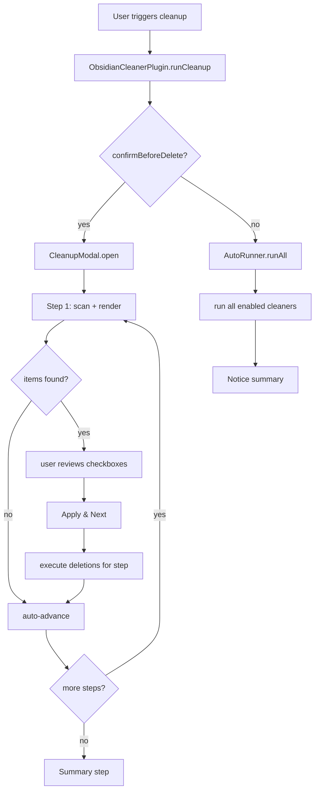

# Design Document: Obsidian Cleaner

## Overview

Obsidian Cleaner is a refactored and significantly expanded Obsidian plugin. The existing single-file "Attachment Cleaner" plugin is restructured into a modular TypeScript codebase with seven distinct cleanup modules, a step-by-step guided modal, configurable deletion modes, per-feature toggles, and optional run-on-startup behavior.

The plugin is renamed from `attachment-cleaner` to `obsidian-cleaner` throughout all artifacts (manifest, package.json, class names, UI strings). The core design principle is that no destructive action is taken without the user either explicitly confirming via the Cleanup_Modal or having opted into automatic mode via settings.

### Key Design Decisions

- **Single entry point**: `main.ts` remains the esbuild entry point; all modules are imported from a `src/` directory.
- **No external runtime dependencies**: Levenshtein distance is implemented inline (small, well-known algorithm) to avoid adding npm dependencies that complicate community plugin submission.
- **Obsidian API only**: All file operations go through `app.vault` and `app.metadataCache` — no direct `fs` calls except `adapter.rmdir` for empty folder removal (the only Vault API gap).
- **Lazy scanning**: Each cleanup module scans only when its step is active in the modal, keeping startup fast.

---

## Architecture

The plugin is organized as follows:

```
main.ts                        # Plugin entry point, re-exports ObsidianCleanerPlugin
src/
  types.ts                     # Shared interfaces and enums
  settings.ts                  # Settings definition, defaults, SettingTab class
  utils/
    levenshtein.ts             # Levenshtein distance utility
    frontmatter.ts             # Frontmatter parse/update helpers
  cleaners/
    orphaned-attachments.ts    # Requirement 5
    conflicted-files.ts        # Requirement 6
    duplicate-files.ts         # Requirement 7
    empty-markdown.ts          # Requirement 8
    empty-folders.ts           # Requirement 9
    tag-cleanup.ts             # Requirement 10
    frontmatter-cleanup.ts     # Requirement 11
  modal/
    cleanup-modal.ts           # Step-by-step Cleanup_Modal (Requirement 12)
    step-renderer.ts           # Per-step UI rendering helpers
```

### Data Flow



---

## Components and Interfaces

### ObsidianCleanerPlugin (`main.ts`)

The main plugin class. Responsibilities:
- Load/save settings
- Register ribbon icon, command, settings tab
- Orchestrate cleanup runs (modal or auto)
- Register all event listeners via `this.registerEvent`

### Settings (`src/settings.ts`)

Defines `ObsidianCleanerSettings` and `ObsidianCleanerSettingTab`. The settings tab renders all toggles, the deletion mode dropdown, frontmatter rules editor, and the run-on-startup toggle.

### Cleaner Modules (`src/cleaners/`)

Each cleaner implements the `Cleaner` interface:

```typescript
interface CleanerResult {
  items: CleanupItem[];
}

interface Cleaner {
  readonly id: CleanupType;
  readonly label: string;
  scan(): Promise<CleanerResult>;
  apply(accepted: CleanupItem[]): Promise<ApplyResult>;
}
```

Each cleaner is self-contained: `scan()` finds candidates, `apply()` executes the accepted actions using the configured `DeletionMode`.

### CleanupModal (`src/modal/cleanup-modal.ts`)

Extends Obsidian's `Modal`. Manages:
- Ordered list of enabled `Cleaner` instances
- Current step index and navigation state
- Per-step scan results and checkbox state
- "Apply & Next", "Skip", "Back" button logic
- Final summary rendering

### StepRenderer (`src/modal/step-renderer.ts`)

Stateless helper that renders a single step's UI into a container element: file list with checkboxes, "Select All" / "Deselect All" controls, step indicator.

### Levenshtein Utility (`src/utils/levenshtein.ts`)

Pure function `levenshtein(a: string, b: string): number` — standard dynamic programming implementation, O(m×n) time and space. Used by `tag-cleanup.ts`.

### Frontmatter Utility (`src/utils/frontmatter.ts`)

Helpers for:
- Parsing frontmatter tags from a file's cached metadata
- Replacing a tag string in raw file content (both frontmatter array entries and inline `#tag` occurrences)
- Checking frontmatter key/value matches against a `FrontmatterRule`

---

## Data Models

```typescript
// src/types.ts

export type DeletionMode = 'system-trash' | 'obsidian-trash' | 'permanent';

export type CleanupType =
  | 'orphanedAttachments'
  | 'conflictedFiles'
  | 'duplicateFiles'
  | 'emptyMarkdownFiles'
  | 'emptyFolders'
  | 'tagCleanup'
  | 'frontmatterCleanup';

export interface FrontmatterRule {
  key: string;
  value?: string | string[];
}

export interface ObsidianCleanerSettings {
  // Feature toggles
  orphanedAttachments: boolean;
  conflictedFiles: boolean;
  duplicateFiles: boolean;
  emptyMarkdownFiles: boolean;
  emptyFolders: boolean;
  tagCleanup: boolean;
  frontmatterCleanup: boolean;

  // Deletion
  deletionMode: DeletionMode;

  // Notifications / confirmation
  confirmBeforeDelete: boolean;
  showNotifications: boolean;

  // Startup
  runOnStartup: boolean;

  // Attachment cleaner legacy
  includedExtensions: string[];

  // Frontmatter rules
  frontmatterRules: FrontmatterRule[];
}

export const DEFAULT_SETTINGS: ObsidianCleanerSettings = {
  orphanedAttachments: true,
  conflictedFiles: true,
  duplicateFiles: true,
  emptyMarkdownFiles: true,
  emptyFolders: true,
  tagCleanup: false,
  frontmatterCleanup: false,
  deletionMode: 'obsidian-trash',
  confirmBeforeDelete: true,
  showNotifications: true,
  runOnStartup: false,
  includedExtensions: ['png','jpg','jpeg','gif','bmp','svg','webp','pdf','mp4','webm','mp3','wav','ogg','flac'],
  frontmatterRules: [],
};

// Represents a single actionable item surfaced by a cleaner
export interface CleanupItem {
  type: CleanupType;
  // Human-readable label shown in the modal
  label: string;
  // Additional detail (e.g. file path, diff snippet, tag pair)
  detail?: string;
  // Opaque payload used by apply()
  payload: unknown;
}

export interface ApplyResult {
  applied: number;
  skipped: number;
  errors: string[];
}
```

### Settings Migration

When loading settings, `Object.assign({}, DEFAULT_SETTINGS, await this.loadData())` ensures new fields introduced in future versions are populated with defaults without breaking existing saved data.


---

## Correctness Properties

*A property is a characteristic or behavior that should hold true across all valid executions of a system — essentially, a formal statement about what the system should do. Properties serve as the bridge between human-readable specifications and machine-verifiable correctness guarantees.*

### Property 1: Disabled toggle excludes cleaner from run

*For any* `ObsidianCleanerSettings` object where a given `CleanupType` toggle is `false`, the list of active cleaners assembled for a cleanup run must not include a cleaner of that type.

**Validates: Requirements 3.2**

---

### Property 2: Settings round-trip

*For any* `ObsidianCleanerSettings` object, serializing it via `saveData` and then deserializing it via `loadData` must produce an object that is deeply equal to the original.

**Validates: Requirements 3.4**

---

### Property 3: Deletion mode dispatches correct vault API

*For any* `TFile` and any `DeletionMode` value, calling `deleteFile(file, mode)` must invoke exactly:
- `vault.trash(file, true)` when mode is `system-trash`
- `vault.trash(file, false)` when mode is `obsidian-trash`
- `vault.delete(file)` when mode is `permanent`

**Validates: Requirements 4.2, 4.3, 4.4**

---

### Property 4: Orphaned attachment scan respects folder and extension filters

*For any* set of vault files and a configured `attachmentFolderPath` and `includedExtensions` list, the orphaned attachments scanner must only return files that are (a) located inside the attachment folder and (b) have an extension in the `includedExtensions` list.

**Validates: Requirements 5.1**

---

### Property 5: File reference detection

*For any* `TFile` and any array of markdown content strings, `isFileReferenced(file, contents)` must return `true` if and only if at least one content string contains the file's `name` or `basename`.

**Validates: Requirements 5.3**

---

### Property 6: Conflicted file pattern detection

*For any* filename string, `isConflictedFile(name)` must return `true` if and only if the filename matches the pattern `<base> (<any text>'s conflicted copy<optional date>).md` (case-insensitive on "conflicted copy").

**Validates: Requirements 6.1**

---

### Property 7: Duplicate file detection and grouping

*For any* set of markdown files, the duplicate file scanner must:
- Flag a file as a duplicate iff its name matches `<base name> <N>.md` (N one or more digits) and a file named `<base name>.md` exists in the same folder
- Group all duplicates sharing the same base name into a single group
- Never include the original `<base name>.md` file in the set of files to be deleted

**Validates: Requirements 7.1, 7.2, 7.4**

---

### Property 8: Empty markdown file detection

*For any* `TFile` with extension `md`, `isEmptyMarkdown(file)` must return `true` if and only if `file.stat.size === 0`.

**Validates: Requirements 8.1**

---

### Property 9: Empty folder detection is recursive

*For any* folder tree, `isEmptyFolder(folder)` must return `true` if and only if the folder contains no files and no sub-folders, evaluated recursively.

**Validates: Requirements 9.1**

---

### Property 10: Protected folders excluded from empty folder candidates

*For any* vault, the empty folder scanner must never include the vault root folder or the `.obsidian` configuration folder in its results, regardless of their contents.

**Validates: Requirements 9.5**

---

### Property 11: Tag similarity detection

*For any* two distinct tag strings `a` and `b`, the tag similarity checker must flag them as candidates if and only if `levenshtein(a, b) <= 2` OR one tag equals the other with a trailing `s` appended (pluralisation check).

**Validates: Requirements 10.2, 10.3**

---

### Property 12: Tag merge completeness

*For any* vault state and any merge operation from `sourceTag` to `targetTag`, after `applyTagMerge(sourceTag, targetTag)` completes, no file in the vault must contain any occurrence of `sourceTag` in either frontmatter or inline positions.

**Validates: Requirements 10.4, 10.5**

---

### Property 13: Frontmatter rule matching

*For any* file frontmatter and any `FrontmatterRule`, `matchesRule(frontmatter, rule)` must return `true` if and only if:
- The frontmatter contains `rule.key` (when `rule.value` is undefined), OR
- The frontmatter value at `rule.key` equals `rule.value` (when `rule.value` is a string), OR
- The frontmatter value at `rule.key` equals any element of `rule.value` (when `rule.value` is an array)

**Validates: Requirements 11.2, 11.3, 11.4**

---

### Property 14: Modal step list matches enabled cleanup types

*For any* `ObsidianCleanerSettings`, the ordered list of steps presented by `CleanupModal` must contain exactly the cleanup types whose corresponding toggle is `true`, in the canonical order: `orphanedAttachments`, `conflictedFiles`, `duplicateFiles`, `emptyMarkdownFiles`, `emptyFolders`, `tagCleanup`, `frontmatterCleanup`.

**Validates: Requirements 12.1**

---

## Error Handling

### File Operation Errors

Each cleaner's `apply()` method wraps every individual file operation in a `try/catch`. Failures are collected into `ApplyResult.errors` and logged to the console. The modal displays a count of errors in the summary step. A single file failure does not abort the remaining operations in the batch.

### Missing Attachment Folder

When `app.vault.config.attachmentFolderPath` is empty or undefined, the orphaned attachments cleaner returns an empty result and emits an Obsidian `Notice` directing the user to configure an attachment folder in Obsidian settings. This is handled in `scan()` before any file iteration.

### Frontmatter Parse Errors

If a file's frontmatter cannot be parsed (malformed YAML), the frontmatter utility logs a warning and treats the file as having no frontmatter, skipping it for frontmatter-dependent operations (tag cleanup, frontmatter cleanup).

### Empty Folder rmdir Errors

`adapter.rmdir` can fail if the folder is not actually empty (race condition with another process). Errors are caught, logged, and included in `ApplyResult.errors`.

### Settings Load Errors

If `loadData()` returns corrupt data, `Object.assign({}, DEFAULT_SETTINGS, data)` ensures all required fields are present. Unknown extra fields are ignored.

---

## Testing Strategy

### Dual Testing Approach

Both unit tests and property-based tests are required. They are complementary:
- Unit tests verify specific examples, edge cases, and integration points
- Property-based tests verify universal correctness across randomized inputs

### Unit Tests

Focus areas:
- `DEFAULT_SETTINGS` contains all required fields with correct defaults (Requirements 1, 3, 4, 13, 14)
- `manifest.json` contains all required community plugin fields (Requirement 15.1)
- `LICENSE` file exists (Requirement 15.2)
- `package.json` dependency versions meet minimums (Requirement 2)
- Conflicted file resolution actions (overwrite, delete, skip) produce correct vault state (Requirement 6.4, 6.5, 6.6)
- Modal "Select All" sets all items to accepted; "Deselect All" sets all to rejected (Requirement 12.5)
- Modal summary shows correct counts after a run (Requirement 12.7)
- Modal back navigation decrements step index (Requirement 12.8)
- Orphaned attachment scan returns empty when attachment folder is not configured (Requirement 5.2)
- Empty folder scan never returns vault root or `.obsidian` (Requirement 9.5)

### Property-Based Tests

**Library**: [fast-check](https://github.com/dubzzz/fast-check) (TypeScript-native, well-maintained, no additional runtime deps)

**Configuration**: Each property test runs a minimum of 100 iterations (`numRuns: 100`).

**Tag format**: Each test is annotated with a comment:
`// Feature: obsidian-cleaner, Property <N>: <property_text>`

**Properties to implement** (one test per property):

| Test | Property | Requirements |
|------|----------|--------------|
| Disabled toggle excludes cleaner | Property 1 | 3.2 |
| Settings round-trip | Property 2 | 3.4 |
| Deletion mode dispatches correct vault API | Property 3 | 4.2–4.4 |
| Orphaned scan respects folder + extension filters | Property 4 | 5.1 |
| File reference detection | Property 5 | 5.3 |
| Conflicted file pattern detection | Property 6 | 6.1 |
| Duplicate detection and grouping | Property 7 | 7.1, 7.2, 7.4 |
| Empty markdown file detection | Property 8 | 8.1 |
| Empty folder detection is recursive | Property 9 | 9.1 |
| Protected folders excluded | Property 10 | 9.5 |
| Tag similarity detection | Property 11 | 10.2, 10.3 |
| Tag merge completeness | Property 12 | 10.4, 10.5 |
| Frontmatter rule matching | Property 13 | 11.2–11.4 |
| Modal step list matches enabled types | Property 14 | 12.1 |

### Test File Structure

```
src/
  __tests__/
    unit/
      settings.test.ts
      manifest.test.ts
      conflicted-files.test.ts
      modal-state.test.ts
    property/
      cleaners.property.test.ts
      tag-cleanup.property.test.ts
      frontmatter.property.test.ts
      modal.property.test.ts
```

Tests are run with `jest` (already compatible with the esbuild TypeScript setup) or `vitest` — either works; `vitest` is recommended for its faster TypeScript support and built-in ESM handling.
